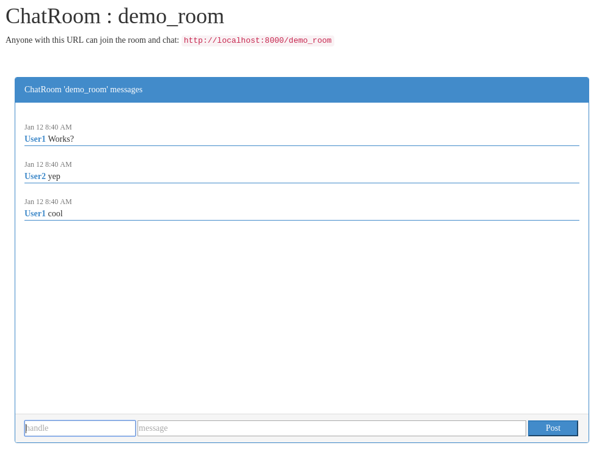

# rznu-lab2
FER RZNU (Service Oriented Computing) course 16/17 lab assignment 2:

---
Simple WebSocket-based chat service using Django Channels.
Great tutorial explaining mechanics and  usage of Channels -  [link](https://blog.heroku.com/in_deep_with_django_channels_the_future_of_real_time_apps_in_django)

## Install
```
pip install -r requirements.txt
python manage.py makemigrations
python manage.py migrate
```

## Run
```
python manage.py runserver
```

## Example:

### Create/join room screen


### Chat

